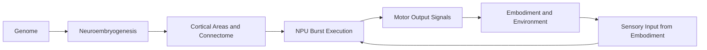

# What Is a FEAGI Brain

A FEAGI brain is a programmable, brain-inspired control system that turns sensory input into motor behavior through structured neural dynamics rather than a single monolithic model. Instead of treating intelligence as one black-box network, FEAGI represents cognition as a living architecture: a set of cortical areas, each with specific roles, connected through explicit wiring rules, and executed continuously in a real-time neural processing loop. The result is an engine designed for embodied intelligence, where perception, action, and adaptation occur as a closed cycle in the context of a robot or simulator.

At the center of that system are five concepts you should understand first: genome, neuroembryogenesis, cortical areas, NPU, and the closed-loop sensorimotor cycle. These concepts map directly to how FEAGI is designed and how you debug it in practice.

## 1) Genome: The Brain Blueprint

In FEAGI, the genome is the specification of a brain, not its runtime state. It describes what regions exist, how large they are, what each region does, and how regions connect. You can think of it as a structural and functional blueprint that can be stored, versioned, shared, and loaded into a running system.

A FEAGI genome typically encodes:

- Cortical area definitions (identity, dimensions, role, and parameters)
- Connectivity declarations between source and target areas
- Morphology and pattern rules for building synapses
- Runtime-relevant defaults for neural behavior and region semantics

Because the genome is explicit, brain design is inspectable and reproducible. You are not guessing what hidden layers learned; you are validating an intended structure against observed behavior.

## 2) Neuroembryogenesis: Building the Brain From the Genome

Neuroembryogenesis is FEAGI's process for turning a genome definition into an instantiated neural structure at runtime. During this phase, the system creates cortical areas, allocates their neural units, and applies connectivity rules to produce the initial connectome.

This process matters because it separates brain definition from brain execution:

- Genome: what should exist
- Neuroembryogenesis: how that specification becomes concrete structures
- Runtime: how those structures fire, propagate, and adapt

For contributors and brain designers, this separation is critical. If behavior is wrong, you can ask whether the issue is in blueprint definition, structural instantiation, or runtime processing.

## 3) Cortical Areas: Functional Regions in 3D Neural Space

Cortical areas are FEAGI's primary functional units. Each area represents a role in the broader system, such as receiving sensory signals, supporting internal processing, storing memory-like dynamics, or driving motor outputs. Areas have spatial structure, which enables pattern-based wiring and localized activity analysis.

A useful mental model is "distributed modules with neural semantics":

- Input-oriented regions receive encoded sensory activity
- Internal regions transform, combine, and route patterns
- Output-oriented regions map activity to actuator commands

Because these regions are explicit objects in the architecture, FEAGI tooling can inspect them directly. In the Brain Visualizer, you can navigate cortical areas, inspect connectivity, and trace whether expected pathways are active.

## 4) NPU: The Execution Engine

The NPU (Neural Processing Unit) is FEAGI's runtime engine that executes neural updates in recurring bursts. During each cycle, activity is propagated through synapses, states are updated, and output-relevant activity becomes available for downstream motor interpretation.

In practical terms, the NPU is where the brain runs as a dynamical system:

- It advances neural state over time
- It applies propagation and update rules repeatedly
- It exposes activity that can be monitored and interpreted

This is why NPU behavior is central to both performance and correctness. If a brain is structurally valid but acts unexpectedly, the NPU cycle and region-level activity traces are usually where diagnosis begins.

## 5) The Closed-Loop Sensorimotor Cycle

FEAGI is designed for embodied loops, not static inference. Sensory streams from the robot or simulator are encoded and injected into input cortical areas. Neural activity evolves through the NPU burst cycle. Output cortical areas are then decoded into motor commands and sent back to the embodiment. That changes the environment, which produces new sensory input, and the cycle continues.

This loop has important consequences:

- Behavior emerges from continuous interaction, not one-shot prediction
- Timing and update cadence matter for stable control
- Debugging must include both neural state and embodiment state
- Learning and adaptation depend on repeated perception-action cycles

In other words, a FEAGI brain is not just "a model that predicts." It is an active controller participating in a live system.

## Conceptual Flow

The diagram shows the two layers of FEAGI operation:

- Build-time or load-time structure formation (genome to instantiated brain)
- Runtime closed-loop control (sensing, neural processing, acting, sensing again)

## Why This Architecture Is Useful

For newcomers, FEAGI's explicit architecture may feel more complex than a single end-to-end neural network. The benefit is control and observability. You can reason about where function lives, how pathways are wired, and which subsystem is responsible when behavior changes.

For practitioners in robotics, this design supports iterative development:

- Start with a clear structural blueprint
- Instantiate and inspect region-level organization
- Run the loop with real or simulated sensors and motors
- Observe activity, adjust genome or mappings, and repeat

That workflow makes FEAGI practical for embodied experimentation where interpretability, modularity, and runtime diagnostics are as important as raw model accuracy.

## Next Steps

To continue from this conceptual foundation:

- Open [Brain Design and Visualization](./index.md) for journey-level guidance
- Follow [Visualizer Getting Started](./visualizer/getting_started.md) to inspect a running brain
- Use [Cortical Areas](./visualizer/cortical_areas.md) and [Mapping Connections](./visualizer/mapping_connections.md) to validate design intent

